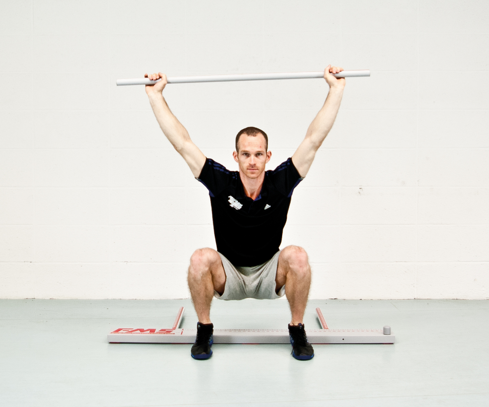
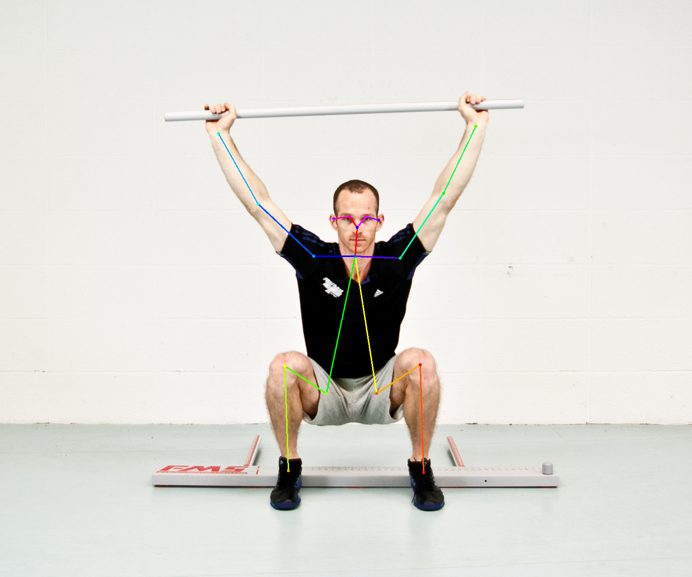
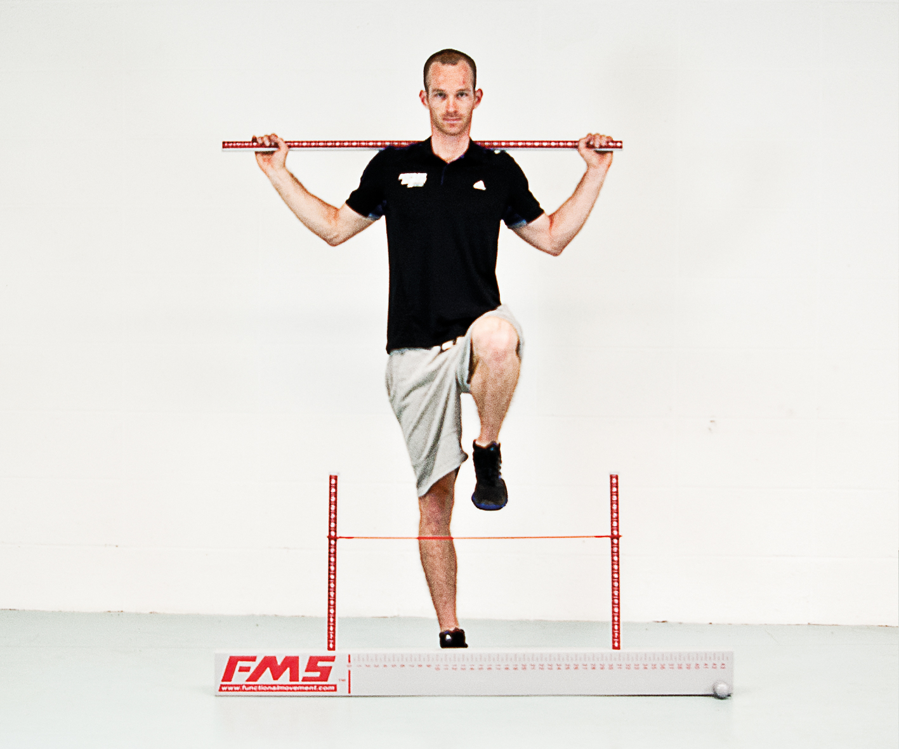
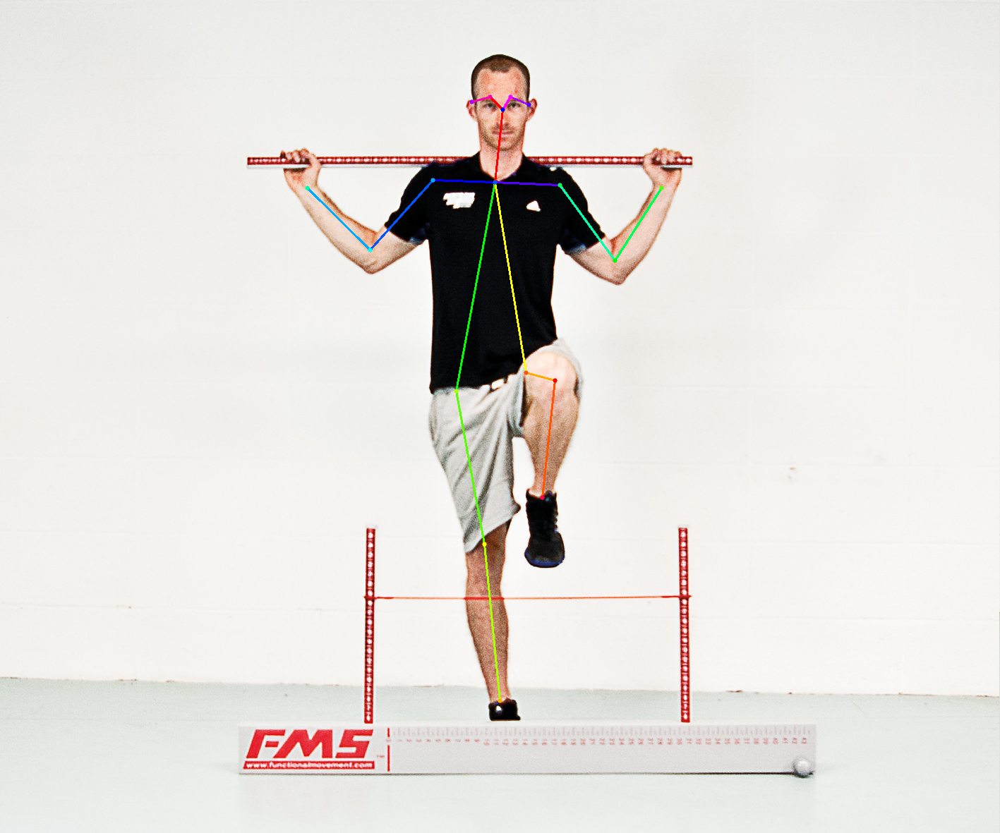
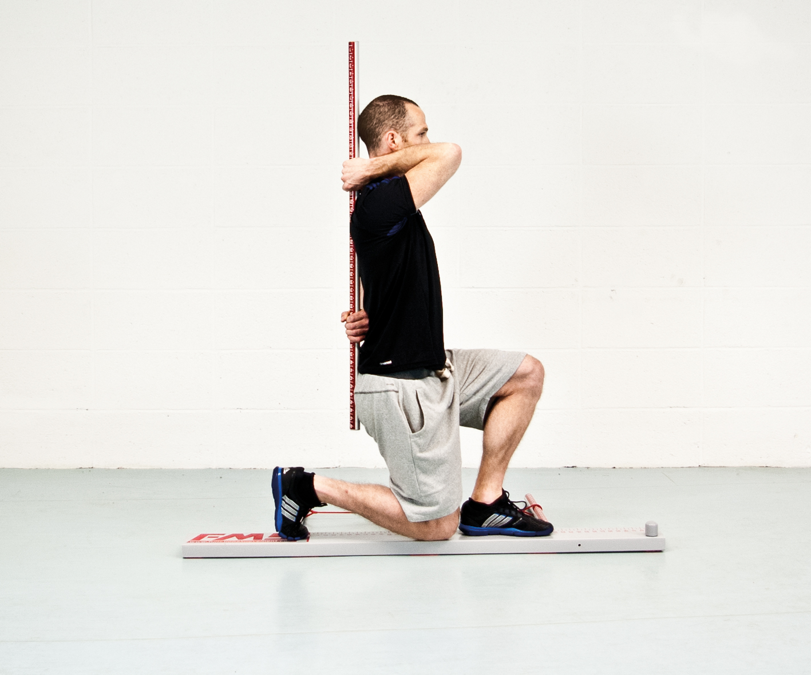
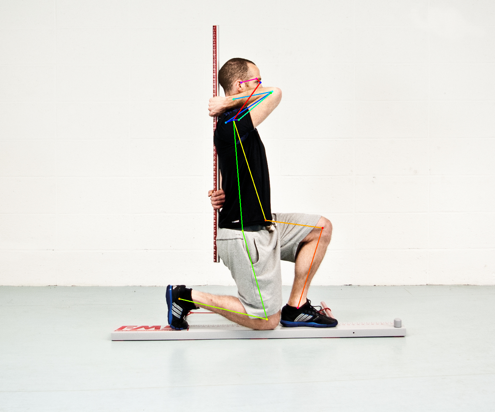
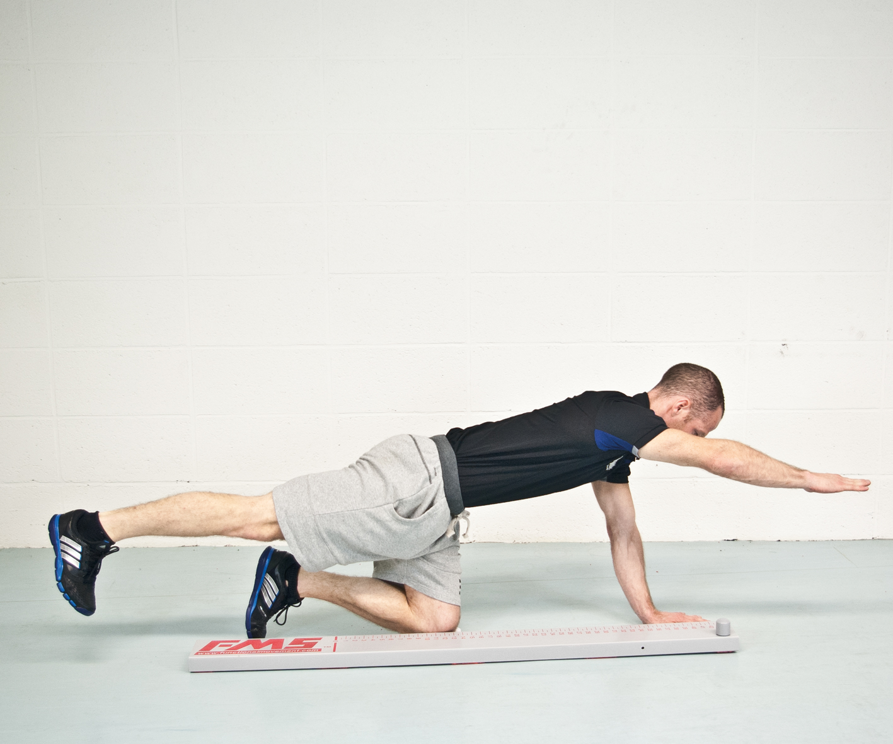
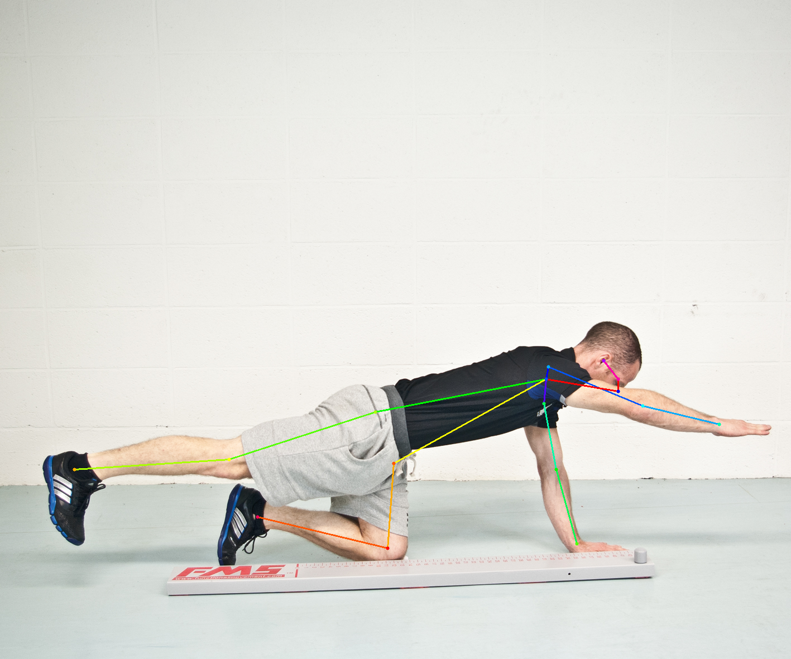

# Chainer Realtime Multi-Person Pose Estimation

Based on the paper [Realtime Multi-Person 2D Pose Estimation using Part Affinity Fields](https://arxiv.org/abs/1611.08050), FMS movements (Deep Squat, Hurdle Step, In-line Lunge, Active Straight-leg Raise, Trunk Stability Push-up, Rotary Stability, Shoulder Mobility) and perform movements prior to the goal of creating an evaluation index similar to the FMS score. Let's implement a model that recognizes and measures posture.

## Table of Contents
1. [Converting caffe model](#convert-caffe-model-to-chainer-model)
2. [Testing](#test-using-the-trained-model)
3. [About FMS](#about-fms)

## Requirements

- Python 3.0+
- Chainer 2.0+
- NumPy
- Matplotlib
- OpenCV

## Convert Caffe model to Chainer model
You can convert it by referring to the caffe model in the [referenced project](https://github.com/ZheC/Realtime_Multi-Person_Pose_Estimation).

```
> cd models
> wget https://github.com/foss-for-synopsys-dwc-arc-processors/synopsys-caffe-models/blob/master/caffe_models/openpose/caffe_model/pose_iter_440000.caffemodel
> wget https://www.dropbox.com/s/d08srojpvwnk252/pose_iter_116000.caffemodel?dl=0
> wget https://www.dropbox.com/s/gqgsme6sgoo0zxf/pose_iter_102000.caffemodel?dl=0

> python convert_model.py posenet pose_iter_440000.caffemodel coco_posenet.npz
> python convert_model.py facenet pose_iter_116000.caffemodel facenet.npz
> python convert_model.py handnet pose_iter_102000.caffemodel handnet.npz
```

## Test using the trained model
First, let's evaluate whether the motion is recognized properly using the existing trained model as an image file.

```
> python pose_detector.py posenet models/coco_posenet.npz --images data/image/deep_squat.jpg data/image/hurdle_step.jpg data/image/in_line_lunge.jpg data/image/rotary_stability.jpg
```

If GPU is supported, use the `--gpu` option.

```
> python pose_detector.py posenet models/coco_posenet.npz --images data/image/deep_squat.jpg data/image/hurdle_step.jpg data/image/in_line_lunge.jpg data/image/rotary_stability.jpg --gpu 0
```

<div align="center">

&nbsp;

</div>

<div align="center">

&nbsp;

</div>

<div align="center">

&nbsp;

</div>

<div align="center">

&nbsp;

</div>
If you have a computer with a camera, you can do a real-time motion recognition test. And you can analyze the video. To quit, just press `q`.

```
> python video_pose_detector.py --video data/video/hurdle_step_video.mp4
```

<div align="center">

</div>

## About FMS
This is a test method that can evaluate joint restrictions, imbalances, asymmetries, and compensations through 7 movement patterns using extreme postures that show imbalances and weaknesses, a movement pattern evaluation designed to evaluate stability and mobility created by Cook.

The process is as follows.

1. Identify functional problems in body movement and score them through 7 movement movements (Deep Squat, Hurdle Step, In-line Lunge, Active Straight-leg Raise, Trunk Stability Push-up, Rotary Stability, Shoulder Mobility),

2. The full score for each item is 3 points,

3. If the total score after the 7 movement tests is 14 points or less, it can be judged that the body problem is exposed, and the body problem is improved through corrective exercise.

*. FMS can check mobility, stability, and movement patterns. - Mobility exercises (ASLR, SM) check the range of motion of joints, the length of tissues, and the flexibility of muscles.
- Stability exercises (TSPU, RS) target the postural control of the start and end positions of each movement pattern.
- Movement patterns (DS, HS, IL) integrate the use of fundamental mobility and stability into specific movement patterns to enhance coordination and timing.

## Reference Repositories
- CVPR'16, [Convolutional Pose Machines](https://github.com/shihenw/convolutional-pose-machines-release).
- CVPR'17, [Realtime Multi-Person Pose Estimation](https://github.com/ZheC/Realtime_Multi-Person_Pose_Estimation).

## Citation
Please cite the original paper in your publications if it helps your research:

 @InProcess{cao2017realtime,
 title = {Realtime Multi-Person 2D Pose Estimation using Part Affinity Fields},
 author = {Zhe Cao and Tomas Simon and Shih-En Wei and Yaser Sheikh},
 booktitle = {The IEEE Conference on Computer Vision and Pattern Recognition (CVPR)},
 year = {2017}
 }.